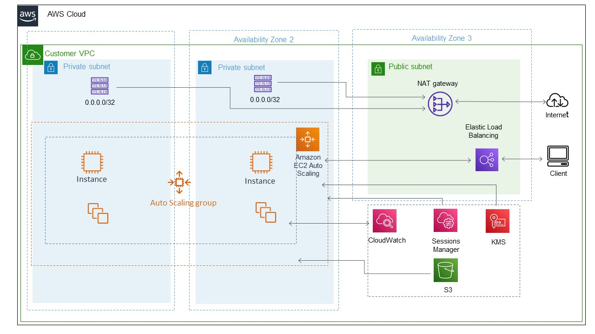
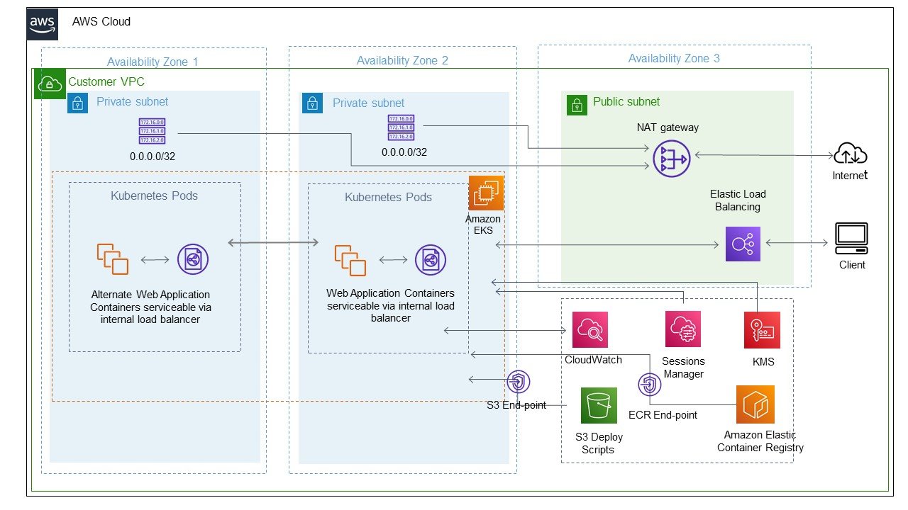

# AWS-Assignment
This Repository contains the IAAC solution for AWS auto-scaling group use-case

## Overview

This repository has the nested AWS cloudformation stack to create various modules required for building the solution for webserver deployment on AWS ASG.
The Solution consists on 4 cloudformation stacks/modules as given below
  - Root Stack
  - Network Stack
  - IAM&Govenance Stack
  - Compute Stack

As we discuss in detail about the each stack/module and its parameters in later sections , let us have a look at the high level architecture diagram of the solution



In order to achieve this solution we have made some assumptions and design decisions as below

  - The user/role who is going to deploy the root stack should have permissions to create Cloudformation stacks
  - The default values for all the parameters are set to lower limits to save cost for the demo deployment, actual values for production wpuld be much higher
  - There is a set of prerequites to be followed before we execute the stack (explained in below section)
  - POLP(Principle of Least Privilage) is used while creating the IAM resources and security groups


### Prerequisites

In order to deploy the stack we must ensure the following prerequites

```
$ Create a S3 bucket (Note down the name, we would require it in parameter section for compute stack)
$ Download/Git clone the code from this repository
$ Upload the "deploy_apache.sh" file from the code to the S3 bucket created
```
Post the prerequisites are completed , we are ready to deploy the stack. Let's understand the input parameters for each of the stack and the resources created by each of them in following sections

### Root Stack/Module

The root stack is the oly stack you need to deploy on cloudformation, it will automatically deploy the nested stacks defined in it.

In this solution the rootstack is the file "Root_Stack.yaml" and it consists of 3 Resources which are the nested stacks/modules as given below

```
$ Network Stack
$ IAM&Govenance Stack
$ Compute Stack
```
The below snapshot is of successful root stack deployment in cloudformation


### Network Stack/Module

The network stack creates all the network related resources for this solution i.e VPC, PrivateSubnets, PublicSubnets, NAT Gateway, Internet Gateway, Route Tables, Application LoadBalancer , Target Group , listener for loadBalancer, Security Groups.
Given below are some input parameters required for the network stack
```
$ VPC Cidr - This is the Cider block for the VPC to be created 
$ Public/Private subnet Cidr - this parameters are to specify cidr's for the subnets to be created inside the VPC
$ MapPublicIpOnLaunch - Boolean, Indicates whether instances launched in this subnet receive a public IPv4 address
$ LoadBalancerName - Name of the loadbalancer which will point to ASG instances in private subnets
```
Find below the snapshot of the nested network stack created successfully along with its outputs


### IAm & Governance Stack/Module

The IAM&Govenance stack creates a IAM role with all the required AWS managed policies attached to it for enabling the AWS SSM so that the instances cam be access via sessions manager without needing the root user keys.
This stack also creates Instance profile for the same role to be attched to the ASG instances.

Find below the snapshot of nested IAM&Govenance stack created successfully along with its outputs


Snapshot of ASG instance connected using AWS sessions manager


### Compute Stack/Module

The network stack creates all the compute resources for this solution i.e Launch Template, AutoScaling Group
Given below are some input parameters required for the compute stack
```
$ NodeAutoScalingGroupDesiredCapacity - Desired capacity of Node Group ASG.
$ NodeAutoScalingGroupMaxSize - Maximum size of Node Group ASG. Set to at least 1 greater than NodeAutoScalingGroupDesiredCapacity.
$ NodeAutoScalingGroupMinSize - Minimum size of Node Group ASG.
$ NodeInstanceType - EC2 instance type for the ASG node instances
$ NodeVolumeSize - Node volume size for root and secondary EBS volume
$ NodeImageId - Latest Amazon Linux2 ami-id
$ deploybucketname - The S3 bucket used to store the deployment scripts for userdata
```
Find below the snapshot of the nested compute stack created successfully along with its outputs


** Note - We have mounted the secondary EBS volume to /var/log/httpd as we are using apache web server which uses that path to store its logs, Also Encryption at rest is enabled for both root volume as well as secondary volume**

### Final Output & Future Enhancements/Roadmap

Post successful deployment of the stack, we can access the test page of Apache web server from the LoadBalancer DNS name as shown in snapshot below


also to enhance this solutions we can add the following mentioned things to it
  - Create mechanism to push the logs from secondary EBS to S3 and then archive it to glacier
  - Create a alerting mechanism using cloudwatch events and SNS to notify if the application healthchecks fail
  - Move the complete design from ASG to containerize it and deploy using EKS

### Alternate Solution

To modernize the above given solution we can evolve it to fit into a containerized way using EKS.
Given below is the high level architecture of a probable alternate solution to the same use-case




Some of the benifits of this alternate solution are
  - Achieve high scalability and availability
  - Easy deployment for microservice based application

**Note - In this solution we can use fluentd daemon set and cloudwath agent daemon sets to consolidate logs for EKS control plane as well as container logs to cloudwatch log groups

### Support Details

In case of any issue regarding Jira service desk or any requests please use the contact details given below

| ContactId | Contact Details |
| ------ | ------ |
| EmailId | adityachap@gmail.com |
| Contact No. | +919158710683 |
